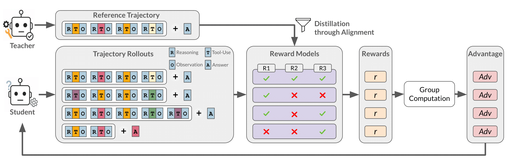
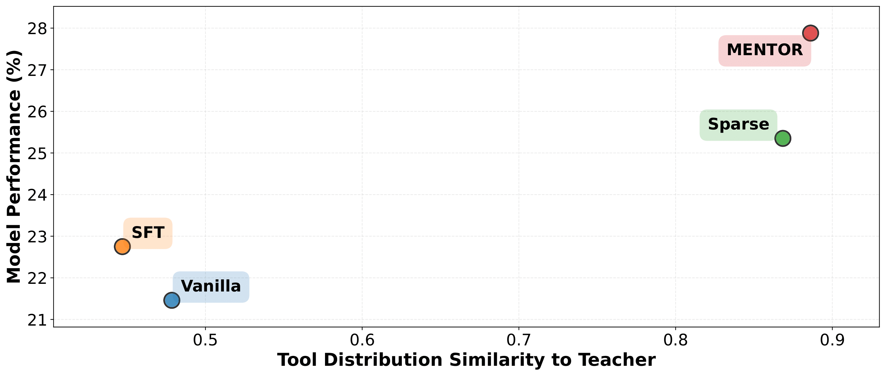

<div align="center">

# MENTOR: Reinforcement Learning Framework for Enabling Tool Use in Small Models via Teacher-Optimized Rewards

[](https://arxiv.org/abs/2510.18383)
[](https://creativecommons.org/licenses/by/4.0/)
[](https://huggingface.co/MENTOR-RL)

**A Reinforcement Learning Framework for Distilling Tool-Use Capabilities from Large to Small Language Models**

[ChangSu Choi](https://github.com/choics2623)¹\*, [Hoyun Song](https://github.com/HoyunS)²\*, Dongyeon Kim², WooHyeon Jung², Minkyung Cho²,
Sunjin Park³, NohHyeob Bae³, Seona Yu³, [KyungTae Lim](https://github.com/jujbob)²†

¹Seoul National University of Science and Technology, ²KAIST, ³LG CNS

\*Equal contribution, †Corresponding author

</div>

## Overview

MENTOR is a reinforcement learning framework that effectively distills tool-use capabilities from large language models (LLMs) to smaller, more efficient models. Unlike traditional supervised fine-tuning (SFT) that suffers from poor generalization, MENTOR combines:

- **RL-based exploration** to learn generalizable problem-solving strategies
- **Teacher-guided dense rewards** to provide fine-grained guidance for efficient tool use

<p align="center">
  
  <br>
  <em>Overview of the MENTOR framework. The student model learns efficient tool-use strategies through RL with dense, teacher-guided rewards.</em>
</p>

### Key Results

MENTOR significantly improves both in-domain and out-of-domain performance compared to SFT and sparse-reward RL baselines:

<p align="center">
  
  <br>
  <em>MENTOR achieves the highest accuracy while learning a tool-use policy most similar to the expert teacher's strategy.</em>
</p>

**Performance Highlights (Qwen2.5-7B):**
- **Math Reasoning**: 21.46% → **27.88%** (+6.42%p)
- **Tool-Calling (BFCL)**: 21.88% → **31.38%** (+9.50%p)
- **RAG Tasks**: 12.23% → **21.23%** (+9.00%p)

---

## 🔧 Installation

### Environment Setup

```bash
# Create conda environment
conda create -n mentor python==3.10
conda activate mentor

# Clone repository
git clone https://github.com/your-repo/MENTOR.git
cd MENTOR

# Install dependencies
pip3 install -e .
pip3 install flash_attn==2.7.4.post1 --no-build-isolation
```

### Optional Dependencies

For Wikipedia RAG evaluation tasks:
```bash
conda install -c pytorch -c nvidia faiss-gpu=1.8.0
```

For mathematical reasoning evaluation:
```bash
# Install Math-Verify for mathematical verification
pip install math-verify[antlr4.9.3]

# Install MathRuler for mathematical grading
git clone https://github.com/hiyouga/MathRuler.git
cd MathRuler
pip install .
cd ..
```

For RAG evaluation with SGLang:
- Follow the [SGLang installation guide](https://docs.sglang.ai/get_started/install.html)

---

## 🚀 Quick Start

### 1. Serving Components

#### Sandbox Server (Required for Training & Evaluation)

```bash
cd scripts/serving
python sandbox.py --port 5000
```

#### Retriever Server (Required for RAG Evaluation)

Download the retriever corpus and index:

```bash
# Download retriever corpus
huggingface-cli download --repo-type dataset RUC-NLPIR/FlashRAG_datasets \
    --include "retrieval-corpus/*" \
    --local-dir ./FlashRAG_datasets

# Download pre-built index
wget https://www.modelscope.cn/datasets/hhjinjiajie/FlashRAG_Dataset/resolve/master/retrieval_corpus/wiki18_100w_e5_index.zip
unzip wiki18_100w_e5_index.zip
```

Configure and start the retriever service:

```bash
cd scripts/serving
# Edit retriever_config.yaml with your paths
python retriever_serving.py \
    --config retriever_config.yaml \
    --num_retriever 4 \
    --port 8081
```

### 2. 📦 Dataset

Download the training dataset from HuggingFace:

```bash
mkdir -p data/train_dataset
cd data/train_dataset
wget https://huggingface.co/datasets/MENTOR-RL/MENTOR-data/resolve/main/data/train-00000-of-00001.parquet -O train.parquet
wget https://huggingface.co/datasets/MENTOR-RL/MENTOR-data/resolve/main/data/test-00000-of-00001.parquet -O test.parquet
cd ../..
```

Dataset available at: [MENTOR-RL/MENTOR-data](https://huggingface.co/datasets/MENTOR-RL/MENTOR-data)

### 3. 🎯 Training

#### Training Qwen2.5-7B

```bash
cd scripts/train
bash train_qwen2.5.sh
```

#### Training Qwen3-8B

```bash
cd scripts/train
bash train_qwen3.sh
```

Before training, configure the following variables in the training scripts:

```bash
TRAIN_BATCH_SIZE=32                    # Adjust based on your GPU memory
PPO_MINI_BATCH_SIZE=8                  # Mini-batch size for PPO
MAX_RESPONSE_LENGTH=8192               # Maximum response length
MAX_NUM_BATCHED_TOKENS=131072          # Maximum batched tokens
ROLLOUT_N=10                           # Number of rollouts per sample
ROLLOUT_TP=2                           # Tensor parallelism for rollout
ROLLOUT_GPU_UTIL=0.8                   # GPU utilization ratio
MAX_TURNS=5                            # Maximum turns for multi-turn
SAVE_FREQ=10                           # Save checkpoint frequency
TEST_FREQ=10                           # Test frequency
TOTAL_EPOCHS=2                         # Total training epochs
WANDB_API_KEY=YOUR_WANDB_API_KEY_HERE  # Your W&B API key
SEARCH_URL=http://localhost:8081       # Retriever service URL
SANDBOX_URL=http://localhost:5000      # Sandbox service URL
SAVE_BASE_DIR=../../saved_models       # Model save directory
TRAIN_FILES="['/path/to/train.parquet']"
TEST_FILES="['/path/to/test.parquet']"
```

**Hardware Requirements:**
- 1 node with 8 GPUs (e.g., 8x H100 80GB)
- Tensor parallelism: 2-4 for 7-8B models

---

## 📊 Evaluation

### 📐 Math Benchmark Evaluation

Evaluate on mathematical reasoning benchmarks (Math-Forge-Hard, Omni-MATH-512, AIME, AMC, MinervaMAth):

```bash
cd scripts/evaluation

# Edit start_inference_bench_sample.sh to configure your paths
bash start_inference_bench_sample.sh
```

Configuration:

```bash
export PYTHONPATH=/path/to/MENTOR:$PYTHONPATH

CUDA_VISIBLE_DEVICES=4,5,6,7 python batch_inference_multiturn_bench.py \
    --dataset_name MENTOR-RL/math-bench \
    --model_path YOUR_MODEL_PATH \
    --hf_token "" \
    --tensor_parallel_size 4 \
    --max_turns 5 \
    --output_file ./results/output.jsonl \
    --batch_size 10000 \
    --categories Math-Forge-Hard Omni-MATH-512 aime24 aime25 amc23 minervamath
```

### 🔍 Multi-hop QA Evaluation

#### Download Evaluation Datasets

```bash
bash download_rag_eval_dataset.sh
```

This downloads the following benchmarks from FlashRAG:
- **bamboogle**: Test split
- **hotpotqa**: Train and dev splits
- **2wikimultihopqa**: Train and dev splits

#### Server Requirements

Ensure the following services are running:

1. **SGLang Server**: For model inference
   - **Note**: SGLang must be installed in your environment
   - Follow the [SGLang installation guide](https://docs.sglang.ai/get_started/install.html)
2. **Retriever Service**: For Wikipedia document retrieval (see above)
3. **Sandbox Service**: For tool execution (see above)

#### Single Evaluation

```bash
cd scripts/evaluation

python run_eval.py \
    --config_path eval_config.yaml \
    --method_name mentor-qwen3 \
    --data_dir ./data/eval_dataset \
    --dataset_name bamboogle \
    --split test \
    --save_dir ./saved_eval \
    --save_note experiment_name \
    --sgl_remote_url http://0.0.0.0:8002 \
    --remote_retriever_url http://0.0.0.0:7777 \
    --sandbox_url http://0.0.0.0:2623 \
    --generator_model /path/to/your/model
```

#### Batch Evaluation

For automated evaluation across multiple models and benchmarks:

```bash
cd scripts/evaluation

# Edit rag_eval.py to configure:
# - MODELS: Dictionary of model names and paths
# - BENCHMARKS: Dictionary of benchmark names and splits
# - Server URLs and ports

python rag_eval.py
```

The script will:
- Automatically start SGLang server for each model
- Run evaluations on all specified benchmarks
- Save results to the configured output directory
- Generate evaluation logs and summaries

---

## 📝 Citation

If you find MENTOR useful for your research, please cite our paper:

```bibtex
@misc{choi2025mentorreinforcementlearningframework,
      title={MENTOR: A Reinforcement Learning Framework for Model Enhancement via Teacher-Optimized Rewards in Small Models},
      author={ChangSu Choi and Hoyun Song and Dongyeon Kim and WooHyeon Jung and Minkyung Cho and Sunjin Park and NohHyeob Bae and Seona Yu and KyungTae Lim},
      year={2025},
      eprint={2510.18383},
      archivePrefix={arXiv},
      primaryClass={cs.CL},
      url={https://arxiv.org/abs/2510.18383},
}
```

---

## 📄 License

This work is licensed under a [Creative Commons Attribution 4.0 International License](https://creativecommons.org/licenses/by/4.0/).

---

## 🙏 Acknowledgments

This work builds upon the following frameworks:
- [verl](https://github.com/volcengine/verl) for efficient RLHF training
- [ReCall](https://github.com/Agent-RL/ReCall) for tool-augmented reasoning implementation
